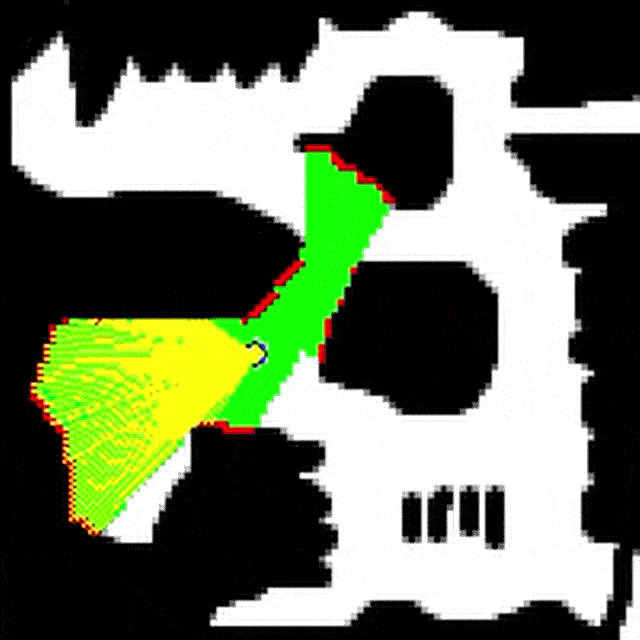

# Robot Exploration 

A tiny two-wheel robot with a 100-ray lidar learns objecthood from pure sensorimotor experience. With no labels or tasks, it samples simple actions and tracks how they distort the lidar stream, revealing stable “things” in the world—structures it can use to predict, navigate, and act coherently.

A lightweight Gym-style setup for 2D robot navigation and exploration using lidar.



Figure interpretation. Black - obstacles. White - free space. Green - explored regions. Yellow - lidar rays. Maroon - detected obstacles. 

Overall, the project explores how autonomous agents can bootstrap internal representations from sensorimotor experience, aiming toward the goal of developing self-sustaining computational systems.

## Environments

Maps are stored as bitmap images in `environments/`.

* **White** = free space
* **Black** = obstacles

## Data Collection

The agent is a differential-drive robot (two wheels) with **100 lidar rays**.

Ensure that requirements are installed 

```bash
!pip install -r requirements.txt
``` 

You can run exploration with predefined strategies. Example: random walk.

```bash
python main.py --strategy random --max_steps 10000 --env 6.png
```

Results are saved automatically to an `output/` folder with timestamped directories. Other strategies include manual control, uniformly distributed random run lengths, levy walks, etc. 

## Training

After generating data, train a representation model (e.g., temporal contrastive learning):

```bash
python -m train.run_train \
    --num_epochs 100 \
    --vis_interval 1 \
    --batch_size 64 \
    --data_dir output/2025-11-14-111925_random_walk_100k \
    --hidden_dims 256 \
    --embedding_dim 64
```

## Analysis

Open the analysis notebook and run the cells:

```
analysis/analysis.ipynb
```
