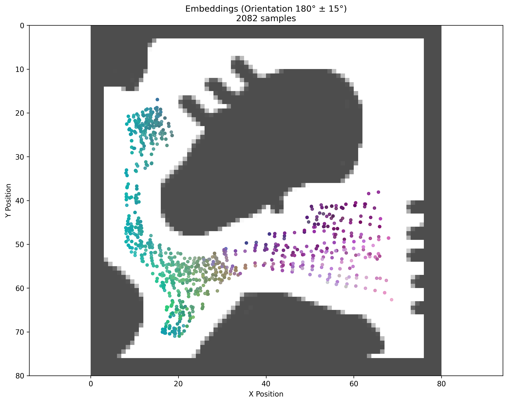
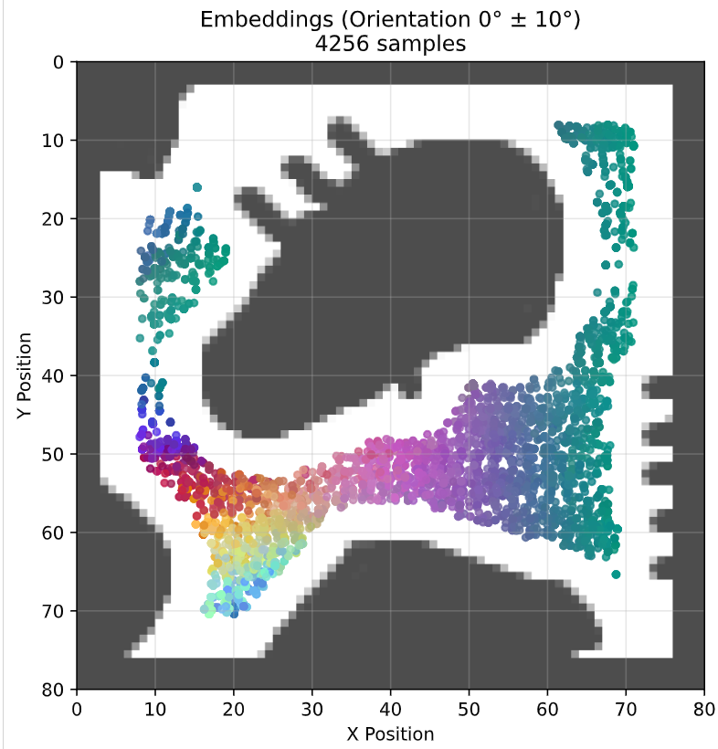

- Get embeddings, cluster them. Plot corresponding lidars of each clusters in a diagram. 
- - option to only get lidar readings that are a given temporal distance apart (to show that even temporarily distant places collapse into a similar embedding)
- Get embeddings, cluster them. Plot a cluster on the map 
- Take embeddings, convert to 3d pca, then rgb. Plot in diagram 
- Take embeddings, but just those within a given orientation, convert to 3d pca, then rgb. Plot in diagram 
- Correlations between features (full embeddings or pca-reduced) with human-intuition of distance to wall, openness, turn intensity 

- Option to save as pdf 
- Option to sample the embeddings in case they are many 
- Option to show arrows (including scale of arrow) 

We aimed to test whether we could have something similar to a shape detector, a proxy for objecthood detection. 

We set up an environment with different shapes: triangles, circles, semicircular grooves, etc. 

The hypothesis was that if we trained a model with temporal continuity learning, then we will have a model that is capable of distinguishing the shapes. How this is done is by: 
- training th

## Results 

It's interesting that a random model shows a clear spatial pattern of clustering even when it's not trained. This is interesting. 

### Neigborhood Preservation 

## Test: Randomly Initialized Network has Structure 
### Setup 
We want to test a theory here: 

That randomly initialized networks will produce structure output for our lidar enabled differential drive even without training. 

Here's what we do. 

- Read lidar readings 
- Pass them through a neural net to give embeddings 
- Convert embeddings to RGB 
- Show RGB embeddings in their locations
- Show RGB embeddings in their locations for a given orientation 

do this in analysis folder

we already have the functions for almost everything 
- gettingn the embedding dimension from metadata 
- getting environment name from meta 
- showing all colored rgb embeddings 
- showing all colored rgb embeddings (oriented)

Make code as simple as possible 

### Results 

It's true: Lidar does have structure even before any training takes place... this is interesting. 

This is an interesting result.

## Test: Inverse Dynamics Model 
Inspired by [Learning to Poke by Poking: Experiential Learning of Intuitive Physics](https://arxiv.org/abs/1606.07419)

The most important takeaway is that LiDAR data contains enough information to determine movement.Evidence: You reached ~97.6% accuracy.Meaning: If you show the model two consecutive scans ($t$ and $t+1$), it can correctly guess which of the 4 directions the robot moved nearly every time. The geometry of the environment (walls getting closer/further) provides a clear signal for movement.

## 
We also want to conduct a few more experiments as follows. Find correlation of embeddings with 
- distance (average distance of the lidar) 
- thickness of the space between the current position (narrowness of a place)... we might want to approach this by finding the x,y position and then looking in the horizontal direction (and finding the expanse - ie what's the distance between the nearest obstacle on the right and the nearest obstacle left) and doing this for the horizontal distance as well
- location (x,y) location
- orientation 

Do this by: 

- taking a given data folder (eg, "output\2025-11-14-111925_random_walk_100k")
- finding the model in the specified training folder (eg "output\2025-11-14-111925_random_walk_100k\train_2025-11-14-195633")
- converting the lidars to embeddings 

- showing correlations between the various attributes 