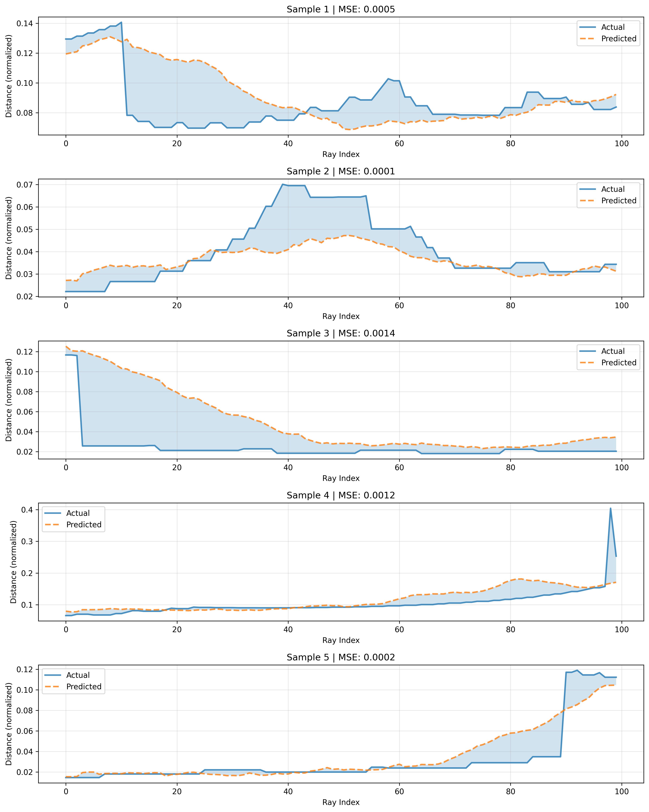

We want to create another part (in another folder seperate from exploration and training) that does active moving to certain objects... it does this even when it got lost during exploration. So we have a chicken and egg problem (of knowing the objects in order to move to them; and moving about in order to discover objecthood!)....

We want to have the robot be biased to moving towards just a few objects (it's interesting how lifeform ever pay attention to just a few stimuli and not the whole barrage of stimulation coming in). 

I don't want us using heavy classical navigation techniques. 

The basic idea is that we can use our knowledge of objecthood, actions (random walk, uniform distribution of random walk sequences, levy, etc) to move towards objects. Perhaps train a neural net to do this. 

The assumption is that the system will capable of the factors that might be helpful in object goal navigation, including (probably): 
- long term association of movements 
- contextual information of where it is

I say probably coz we humans aren't very good at expressing the factors that an intelligence would consider to make it successful. 

What's a good balance between exploration and exploitation... Is there a way to encode this in a natural way that is free from human handcrafting. 

{202511191511:
# Experiment
We want to perform this experiment 
Associative memory 
Transformer (maybe or not)
Uniformly distributed run lengths 
Attaching certain actions (runs) to certain perceptions
---

The agent moves about (taking in lidar readings)

As it moves, it creates embeddings through its perceptual network (the contrastive learning one) 

Also as it moves, it also **stores percepts and actions into an associative memory**

Also as it moves, it **retrieves percepts and actions from the associative memory**

We want to see how good it is at returning to certain percepts, even after long explorations.

There's a bootstrapping problem here: 
- the percepts develop from moving about 
- 

---
Are neural networks the thing to help with this? I think that they are not. But if not, what else might be a good alternative? 

When we think about how we move about: we derive a lot of informational cues from the environment. How would we have a system that learns to extract informational cues (eg, by scanning around the room). We don't want to handcraft this sort of thing. We want to have a system that is capable of exploring this space of intelligence. It's not clear how neural networks can do this? What makes language really convenient for transformers and learning is that we have a lot of examples of it. It's already perfect data out there. There's not so much for robots (perhaps there are datasets that one might want to look into). And I think that if we had a way of perfecting trajectories from random motion, then we would have something even more beautiful than the massive datasets of language. That is: language is limited by human beings - there's only so much "pure data" as there are humans (even if LLMs have become really good at writing and producing language). If we can have a way of getting *fit* paths from random explorations, then we have something massive than language datasets. We will then essentially be constrained only by the number of active agents exploring the world, not by human beings producing trajectories. 

"LIFE — Latent Information for Fitness Enhancement" sounds like a good name for a system. 

We can have a system that does random walks be sufficient to survive. Again we might want to give our agents abilities, rather than optimizing for shortest paths to objects or something like that. 

} 

{202511221223:
# More ineresting experiments 
I recently tried experiments on inverse dynamics (trying to predict actions from lidar readings) and it gave impressive results (97% accuracy). I want us to try a couple of more interesting experiments. 

I think that most interesting would be going to a place with a particular shape 

How about we try encoding the readings and actions into something that is really invariant. 

What about we took a couple of past n readings and we try to encode this instead of just using a single reading. What if we used past n readings... how would the architecture inputs, outputs, look like?

## Forward Dyanmics

I did try to implement this, and it's not producing good results. 

## Autoencoder 

Let's try to see if we can reconstruct lidar readings. 

The setup is simple: 
- Inputs lidar reading
- Encode to latent dimension 
- Output reconstruction 

}